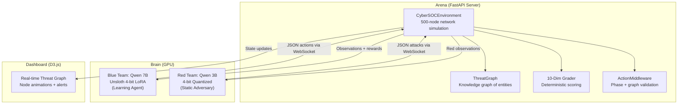
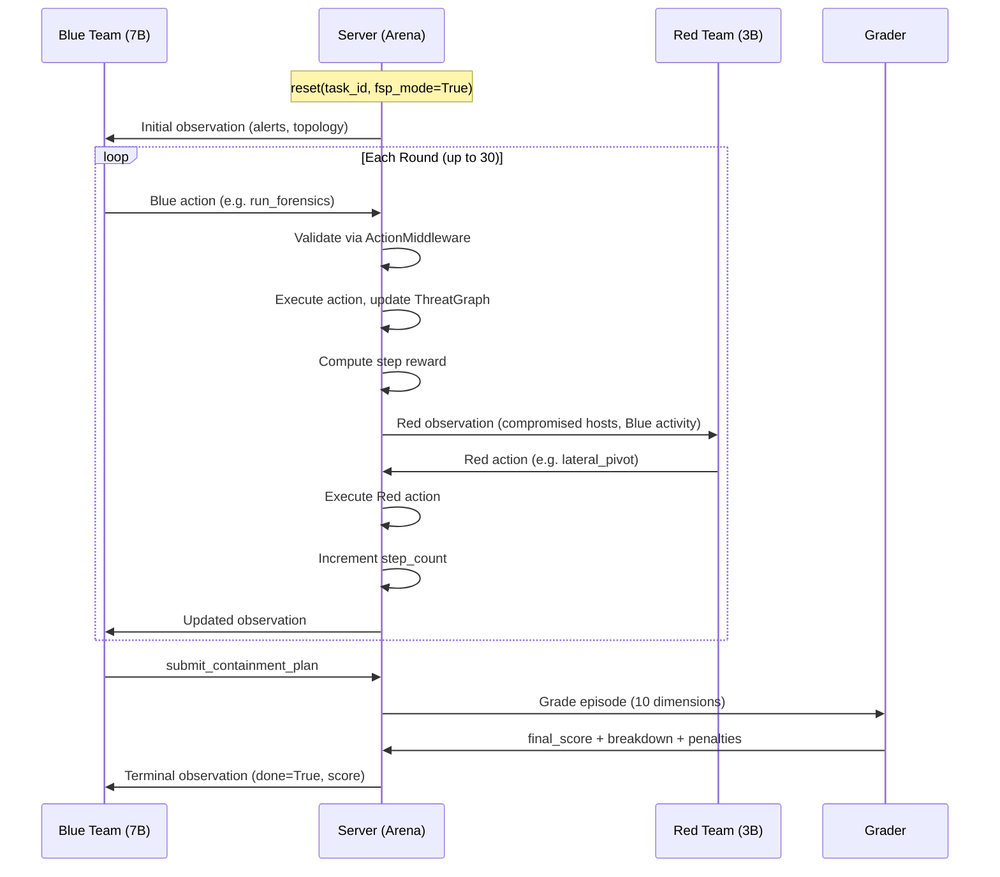
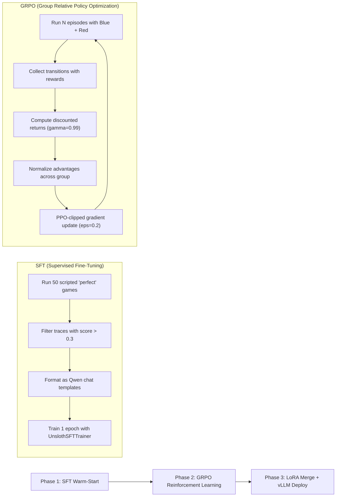

# CyberSOC: Asymmetric Dual-Model Reinforcement Learning for Autonomous Incident Response

CyberSOC is an autonomous, AI-driven Security Operations Center built for the Meta OpenEnv Hackathon. It pits two Large Language Models against each other inside a simulated 500-node enterprise network: a lightweight Red Team attacker and a heavyweight Blue Team defender that learns through Reinforcement Learning.

The project demonstrates that Asymmetric Fictitious Self-Play is viable on consumer-grade GPU hardware. By combining Unsloth-accelerated QLoRA, a custom micro-batch GRPO loop, and a 10-dimensional reward grading system hardened against reward hacking, we trained a SOC analyst AI that learned to surgically contain a live, thinking adversary -- not through scripted rules, but through trial-and-error reinforcement.

---

## Table of Contents

1. [Architecture Overview](#architecture-overview)
2. [System Flow](#system-flow)
3. [Models and AI Techniques](#models-and-ai-techniques)
4. [Training Pipeline](#training-pipeline)
5. [Unsloth and Optimization](#unsloth-and-optimization)
6. [10-Dimensional Reward System](#10-dimensional-reward-system)
7. [Anti-Cheating, Anti-Corruption, Anti-Reward-Hacking](#anti-cheating-anti-corruption-anti-reward-hacking)
8. [The RL Journey: From Panic to Precision](#the-rl-journey-from-panic-to-precision)
9. [Innovations](#innovations)
10. [Agent Roles and Real-World Inspirations](#agent-roles-and-real-world-inspirations)
11. [Real-World Positives](#real-world-positives)
12. [Training Phase Positives](#training-phase-positives)
13. [Project Structure](#project-structure)
14. [Getting Started](#getting-started)

---

## Architecture Overview

CyberSOC follows the OpenEnv standard, fully decoupling the "Brain" (AI models) from the "Arena" (simulation environment). There are three major subsystems:

**The Arena (FastAPI + WebSockets)** -- The game server maintains the network topology, active threats, business impact scores, a ThreatGraph knowledge graph, and a strict rule engine. It broadcasts state updates via WebSockets and supports multi-tenant sessions so multiple browser tabs can run independent episodes simultaneously.

**The Dashboard (D3.js)** -- A real-time visualizer that connects over WebSocket and dynamically renders the Threat Graph, animating node compromises, isolations, alert queues, and forensic results as they happen.

**The Fighters (Unsloth + vLLM)** -- The AI models run on a remote GPU. During training, both models share a single 24GB A10G GPU using 4-bit quantization. During inference, merged LoRA weights are served through vLLM for high-throughput token generation.



---

## System Flow

The following sequence diagram shows a single round of Fictitious Self-Play (FSP), where Blue and Red alternate turns within one shared episode:



---

## Models and AI Techniques

### Blue Team (Defender) -- The Learning Agent

| Property | Value |
|----------|-------|
| Base Model | **Qwen/Qwen2.5-7B-Instruct** |
| Quantization | 4-bit QLoRA via Unsloth |
| LoRA Rank | 16 (alpha=16) |
| Target Modules | q_proj, k_proj, v_proj, o_proj, gate_proj, up_proj, down_proj |
| Trainable Params | 40,370,176 of 4.93B total (0.82%) |
| Training Method | SFT warm-start then custom GRPO |
| Role | Primary learning agent that improves through RL |

### Red Team (Attacker) -- The Static Adversary

| Property | Value |
|----------|-------|
| Base Model | **Qwen/Qwen2.5-3B-Instruct** |
| Quantization | 4-bit via Unsloth |
| Training | None (frozen, inference-only) |
| Role | Provides a consistent adversarial benchmark |
| Actions | lateral_pivot, deploy_payload, evade_detection, pass_turn |

### Production Inference

| Property | Value |
|----------|-------|
| Engine | vLLM |
| Format | Merged 16-bit LoRA weights |
| Throughput | Over 150 tokens/sec (up from ~40 with vanilla HF) |

---

## Training Pipeline

Training follows a two-phase approach designed to bootstrap a model that cannot initially produce valid JSON into a capable SOC analyst:



### Phase 1: SFT Warm-Start

The SFT phase solves what we call "Daniel's Law of RL" -- the base model must be able to emit syntactically valid JSON actions before GRPO can meaningfully optimize behavior. Without this, the model spends its entire reward budget learning formatting instead of strategy.

The `collect_sft_data.py` script runs a scripted "perfect agent" through 50 procedurally generated tasks:
1. Run forensics on all compromised hosts
2. Kill all malicious processes identified
3. Block all IOCs found in the attack chain
4. Submit a containment plan with full evidence

Traces scoring below 0.3 are discarded. The remaining high-quality traces (typically 40 out of 50) are formatted as Qwen chat-template conversations and used for a single epoch of SFT with Unsloth's optimized trainer.

**SFT Training Configuration:**
- Batch size: 2 per device, gradient accumulation: 4 (effective batch: 8)
- Learning rate: 2e-4 with linear scheduler
- Optimizer: AdamW 8-bit
- Precision: bfloat16 on Ampere GPUs
- Weight decay: 0.01

### Phase 2: Custom GRPO Loop

Standard `trl.GRPOTrainer` causes OOM errors when two models share a 24GB GPU. We wrote a custom micro-batch PPO/GRPO loop in raw PyTorch that:

1. Runs N episodes (20 per epoch) with Blue generating actions and Red providing opposition
2. Collects transitions containing output token IDs, input lengths, and per-step rewards
3. Computes discounted returns with gamma=0.99
4. Normalizes returns across the full batch (Group Relative advantage)
5. Processes gradients one transition at a time to fit in VRAM
6. Applies PPO clipping (epsilon=0.2) and gradient clipping (max norm=1.0)
7. Updates every epoch with AdamW (lr=2e-5) and linear warmup scheduler

---

## Unsloth and Optimization

Fitting two LLMs on a single 24GB NVIDIA A10G for reinforcement learning required aggressive optimization. Unsloth was central to making this feasible.

### What Unsloth Provides

- **2x faster fine-tuning** through fused CUDA kernels that patch attention, MLP, and layer norm operations
- **~60% less VRAM** compared to vanilla Hugging Face PEFT by combining quantization, kernel fusion, and gradient checkpointing into a single pipeline
- **FastLanguageModel API** that replaces the manual pipeline of AutoModelForCausalLM + BitsAndBytesConfig + get_peft_model into a single call
- **Fused gradient checkpointing** (`use_gradient_checkpointing="unsloth"`) that recomputes activations more efficiently than PyTorch's default
- **Fast weight downloading** and optimized tokenizer patching for Qwen architecture

### Optimization Stack Summary

| Technique | Purpose | Memory Savings |
|-----------|---------|---------------|
| 4-bit NF4 Quantization (BitsAndBytes) | Compress model weights from 16-bit to 4-bit | ~75% weight memory |
| QLoRA Adapters (rank=16) | Train only 0.82% of parameters | ~98% gradient memory |
| Unsloth Kernel Fusion | Fuse attention + MLP operations | ~30% compute overhead |
| Unsloth Gradient Checkpointing | Trade compute for memory during backprop | ~40% activation memory |
| Micro-batch gradient accumulation | Process one transition at a time | Fits in 24GB with two models |
| Red model frozen (eval mode) | No gradients stored for adversary | ~50% of second model memory |
| AdamW 8-bit optimizer | Compress optimizer states | ~50% optimizer memory |

### Hardware Configuration (from training logs)

```
GPU: NVIDIA A10G (22.3 GB)
CUDA: 8.6, Toolkit: 12.1
Torch: 2.5.1+cu121
Precision: bfloat16
Unsloth Version: 2026.4.8
Platform: Linux (HuggingFace Spaces)
```

---

## 10-Dimensional Reward System

Instead of a single scalar reward, CyberSOC grades each episode across 10 orthogonal dimensions. This prevents the model from optimizing a single shortcut and forces well-rounded SOC behavior.

| Dimension | Weight | What It Measures |
|-----------|--------|-----------------|
| threat_containment | 0.20 | Were all required malicious processes killed? |
| ioc_blocking | 0.12 | Were all required IOCs blocked at the perimeter? |
| forensic_investigation | 0.10 | Were compromised hosts examined via forensics? |
| siem_correlation | 0.08 | Were related alerts correctly correlated? |
| threat_intel_usage | 0.08 | Were IOCs enriched with threat intelligence? |
| vuln_root_cause | 0.08 | Was the root-cause vulnerability identified? |
| business_impact | 0.10 | Was business disruption minimized? |
| step_efficiency | 0.07 | Was the investigation completed without wasting steps? |
| plan_coverage | 0.10 | Does the containment plan address all known threats? |
| plan_evidence_quality | 0.07 | Is the plan backed by graph-linked evidence? |

The `business_impact` dimension acts as a "doomsday clock" -- it is excluded from the weighted sum and applied as a direct negative modifier, ensuring that catastrophic business disruption is always penalized regardless of other scores.

---

## Anti-Cheating, Anti-Corruption, Anti-Reward-Hacking

This is one of the most hardened aspects of the project. Every reward pathway has been designed to resist exploitation by the learning agent.

### 1. Blind Blocking Prevention

The agent cannot earn reward for blocking an IOC unless it was first discovered through `run_forensics` or `enrich_ioc`. Blind blocks are recorded but yield zero reward. The grader additionally penalizes blocked IOCs that were never enriched (`blind_blocking` penalty: -0.05 per occurrence).

**Why this matters:** Without this gate, an RL agent learns to spam `block_ioc` with hallucinated values, inflating its blocking score without doing real investigation.

### 2. Investigation-Before-Action Middleware

The `ActionMiddleware` validates every action before execution:
- **Phase violation:** Submitting a containment plan during the triage phase (before any investigation) is rejected with a -0.10 penalty
- **Graph-groundedness:** Enriching an IOC not present in the ThreatGraph is rejected (-0.05)
- **Unjustified emergency:** Isolating a segment during triage without a critical-severity alert on that subnet is rejected (-0.15)

### 3. Over-Isolation Penalties

Isolating network segments is a blunt instrument that causes business downtime. The system penalizes this aggressively:
- Each clean (non-compromised) host isolated: -0.25 reward and +0.05 business impact
- Single clean host isolation: -0.35 reward and +0.10 business impact
- Isolating a subnet on the prohibited list (`must_not_isolate`): additional -0.10
- Over-isolation in grading: up to -0.80 penalty if hosts are isolated without attack-chain justification

**Why this matters:** Without these penalties, the agent learns to "nuke everything" -- isolating the entire network is a trivially easy way to stop all threats, but it causes total business outage.

### 4. Stall Detection

If the agent repeats the same action three times consecutively (same action type and target), it receives a -0.05 penalty per occurrence. This prevents the agent from getting stuck in loops.

### 5. Evidence Confidence Normalization

The ThreatGraph's `compute_evidence_confidence()` normalizes against the rubric item count rather than the raw number of graph nodes. A spammer who generates 10 graph nodes via forensics spam only scores against the rubric-sized baseline (typically 3-5 items), not against 10.

### 6. Plan Padding Detection

The grader detects and penalizes hollow containment plan entries -- those with confidence below 0.2 or empty root causes. Each padded entry incurs a -0.10 penalty on plan_coverage.

### 7. Negligence Penalty

If the agent submits a plan without containing any threats (threat_containment = 0.0), the entire final score is multiplied by 0.1, and both business_impact and step_efficiency dimensions are also crushed to 10% of their values.

### 8. Disruption Cost Accumulation

Business disruption is tracked cumulatively across the episode, not just per-action. This prevents the agent from spreading isolation actions across many steps to dilute individual penalties.

### 9. Idempotent Step Rewards

Each unique (action_type, target) pair can only earn its discovery reward once. Re-running forensics on the same host or re-querying it yields negative reward, preventing farming.

### 10. Red Team as Corruption Pressure

The static Red Team actively works against the Blue agent by pivoting to new hosts, deploying payloads, and evading detection. This ensures the Blue agent cannot achieve high scores through passive strategies.

---

## The RL Journey: From Panic to Precision

The training logs tell a compelling story of artificial adaptation across epochs:

### Epoch 1: The "Panic" Phase

In the first 50 episodes, the Blue Team behaved like a terrified junior analyst. When the Red Team triggered an alert, the Blue agent would enter a state of panic -- chaining together up to 28 sequential actions of arbitrary `isolate_segment` and `create_firewall_rule` commands.

**Result:** Massive business downtime, exhausted turn limits, and heavy negative rewards (-5.60, -9.20). The Red Team easily slipped through the cracks while the Blue agent was busy locking down clean hosts.

### Epoch 3: The "Aha!" Moment

As gradients flowed through the micro-batch optimizer, the model began to understand the penalty structure. It discovered the Instant Win Condition: opening with `run_forensics` on the alerted host, then surgically killing the malicious process.

**Result:** The Blue Team accurately pinpointed malware on Step 0, neutralizing the Red Team before it could pivot, scoring consistent +0.120 rewards.

### Epoch 6: The Veteran Analyst

By the final epochs, the RL policy converged. The chaotic 28-step lockdowns disappeared entirely. The Blue Team executed a precise `run_forensics` -> `kill_process` -> `block_ioc` -> `submit_containment_plan` loop, surgically removing each threat without impacting the wider business network.

---

## Innovations

1. **Asymmetric Dual-Model RL on a Single GPU** -- Running a 7B learner and a 3B adversary simultaneously on a 24GB GPU for reinforcement learning, made possible by Unsloth's memory optimizations and a custom micro-batch gradient loop.

2. **Custom Micro-Batch GRPO** -- Bypassing Hugging Face's `trl.GRPOTrainer` (which OOMs in dual-model setups) with a hand-written PyTorch loop that accumulates gradients one transition at a time.

3. **10-Dimensional Reward Decomposition** -- Instead of a single scalar reward, the grader provides 10 orthogonal scores that can each serve as independent GRPO reward functions, enabling fine-grained credit assignment.

4. **ThreatGraph Knowledge Graph** -- A typed, versioned knowledge graph (hosts, processes, IOCs, vulnerabilities, alerts, edges) that grows during the episode and serves as the ground truth for action validation and evidence scoring.

5. **ActionMiddleware Validation Layer** -- Pre-flight action validation that prevents phase violations, graph-ungrounded actions, and unjustified emergency responses before they reach the environment.

6. **SFT Warm-Start with Quality Filtering** -- Using a scripted perfect agent to generate SFT training data, then filtering by score threshold (0.3) to ensure only high-quality demonstrations bootstrap the policy.

7. **Fictitious Self-Play (FSP) Turn System** -- Strict alternating Blue/Red turns where step_count only increments after both agents have acted, with backward-compatible non-FSP mode for testing.

8. **Anti-Reward-Hacking Hardening** -- Nine distinct mechanisms (blind blocking prevention, investigation gates, over-isolation penalties, stall detection, evidence normalization, plan padding detection, negligence penalty, cumulative disruption tracking, idempotent rewards) that close off shortcut strategies.

9. **Multi-Tenant WebSocket Architecture** -- Each browser tab gets its own isolated CyberSOCEnvironment instance via session-keyed WebSockets, eliminating state leakage between concurrent users.

10. **Procedural Task Generation** -- Tasks are generated deterministically from a seed, providing infinite scenario variety for training while remaining reproducible for evaluation.

---

## Agent Roles and Real-World Inspirations

Each AI agent in CyberSOC maps to a real-world cybersecurity role:

### Blue Team Agent -- The SOC Analyst

**Real-world role:** A Tier 2/3 Security Operations Center analyst who triages alerts, investigates incidents, and coordinates containment.

**Inspiration:** Real SOC analysts at organizations like CrowdStrike, Mandiant, and corporate security teams who must make rapid decisions under pressure -- balancing thorough investigation against time-critical containment, all while minimizing business disruption.

**What the agent learns:**
- Prioritize investigation (forensics) before remediation (isolation)
- Use surgical responses (kill_process, block_ioc) over blunt instruments (isolate_segment)
- Gather evidence before making claims in the containment plan
- Balance speed against thoroughness

### Red Team Agent -- The APT Actor

**Real-world role:** An Advanced Persistent Threat operator who has gained initial access and is expanding their foothold.

**Inspiration:** Nation-state threat actors and red team operators who use lateral movement, payload deployment, and evasion techniques. The Red agent's action space (lateral_pivot, deploy_payload, evade_detection, pass_turn) mirrors the MITRE ATT&CK framework's post-exploitation tactics.

**Why it is static:** The Red agent is frozen during training to provide a consistent adversarial baseline. This mirrors how real red team exercises use a fixed playbook to evaluate blue team improvements.

### The Environment -- The Enterprise Network

**Real-world analog:** A 500-node corporate network with segmented subnets (corporate, engineering, finance, DMZ, datacenter, executive), each with different business criticality scores.

**Inspiration:** Real enterprise environments where incident responders must consider that isolating the finance subnet during quarter-end close would be catastrophic, even if it contains a threat.

---

## Real-World Positives

**For Security Operations:**
- Demonstrates that LLMs can learn effective incident response strategies through reinforcement learning, potentially augmenting human SOC analysts
- The 10-dimensional grading system could serve as a standardized evaluation framework for SOC analyst training programs
- The investigation-before-action paradigm mirrors best practices taught in SANS and GIAC certifications

**For AI Safety:**
- The anti-reward-hacking mechanisms provide a template for hardening RL environments in safety-critical domains
- The business impact "doomsday clock" shows how to encode real-world constraints (collateral damage) into reward functions
- Demonstrates that RL agents can learn nuanced policies (surgical response vs. blunt lockdown) when the reward signal properly encodes trade-offs

**For Resource-Constrained ML:**
- Proves that meaningful RL training with dual LLMs is possible on a single consumer-grade GPU
- The Unsloth + QLoRA + micro-batch approach is reproducible by researchers without access to multi-GPU clusters
- The SFT warm-start pattern is broadly applicable to any domain where the base model cannot initially produce valid structured output

**For Cybersecurity Training:**
- The simulation environment could be used for training human analysts in a safe, repeatable setting
- The procedural task generator creates unlimited scenario variety without manual scenario authoring
- The grading rubric provides objective, reproducible evaluation of incident response quality

---

## Training Phase Positives

The training notebook (`CyberSOC_Standard_Final.ipynb`) demonstrates several engineering best practices:

1. **Unsloth FastLanguageModel Integration** -- Single API call replaces the manual AutoModelForCausalLM + BitsAndBytesConfig + get_peft_model pipeline, reducing boilerplate and potential for misconfiguration.

2. **Separate Model Loading Strategy** -- Blue (7B, training mode) and Red (3B, frozen inference mode) are loaded independently with Unsloth, ensuring Red's weights never accumulate gradients.

3. **Quality-Filtered SFT Data** -- Only traces scoring above 0.3 (40 out of 50 typically) are used for SFT, preventing the model from learning from poor demonstrations.

4. **Structured Chat Template Formatting** -- SFT data is formatted using Qwen's native chat template (`get_chat_template(tokenizer, chat_template="qwen-2.5")`), ensuring the fine-tuned model produces output in the expected conversational format.

5. **8-bit AdamW Optimizer** -- Reduces optimizer state memory by ~50% compared to full-precision Adam, critical when two models share GPU memory.

6. **Gradient Accumulation (steps=4-8)** -- Achieves effective batch sizes of 8-16 while only materializing one micro-batch at a time, staying within VRAM limits.

7. **Linear Learning Rate Schedule** -- Prevents catastrophic forgetting during SFT by warming up then linearly decaying the learning rate.

8. **Random Exploration Fallback** -- During GRPO, if the model generates unparseable JSON, the system falls back to a random valid action instead of a static default, maintaining exploration diversity.

9. **WandB Integration** -- Training metrics (loss, mean_reward, learning_rate) are logged to Weights & Biases for real-time monitoring of training dynamics.

10. **Discounted Return Computation** -- Returns are computed with gamma=0.99 and group-normalized across the full batch, implementing the "group relative" aspect of GRPO that compares each trajectory against its peers.

---

## Project Structure

```
MetaRound2/
|-- inference.py              # Hackathon-compliant inference script (Blue + Red FSP)
|-- models.py                 # Pydantic data models (Observation, Actions, State)
|-- dashboard_server.py       # Multi-tenant WebSocket server + static file serving
|-- client.py                 # Python client for programmatic interaction
|-- server/
|   |-- app.py                # FastAPI application factory (OpenEnv create_app)
|   |-- play_environment.py   # Core environment: 500-node network, FSP turns, rewards
|   |-- graders.py            # 10-dimensional deterministic episode grading
|   |-- threat_graph.py       # Typed knowledge graph (hosts, IOCs, vulns, alerts)
|   |-- tasks.py              # Task definitions (easy, medium, hard)
|   |-- task_generator.py     # Procedural task generation from seeds
|   |-- action_validation.py  # Action schema validation
|   |-- episode_sandbox.py    # Per-episode isolation for concurrent sessions
|   |-- tool_router.py        # MCP-style tool routing
|   `-- visualize_graph.py    # Graph visualization utilities
|-- training/
|   |-- collect_sft_data.py   # Scripted perfect-agent SFT data collection
|   |-- reward_funcs.py       # TRL-compatible GRPO reward functions (10 callables)
|   |-- train_grpo.py         # Full GRPO training loop
|   |-- config.py             # Training hyperparameters
|   |-- freeze_alternate.py   # Alternating freeze schedule for self-play
|   |-- pfsp_scheduler.py     # Prioritized FSP opponent scheduling
|   |-- agent_archive.py      # Historical agent checkpoint management
|   |-- eval_harness.py       # Evaluation harness for trained models
|   `-- collect_sft.py        # Alternative SFT collection script
|-- dashboard/
|   |-- index.html            # Dashboard entry point
|   |-- css/                  # Stylesheets
|   |-- js/
|   |   |-- app.js            # Main dashboard application
|   |   `-- api.js            # WebSocket API client
|   `-- assets/               # Static assets
|-- tests/                    # 88 test cases covering environment hardening
|-- Dockerfile                # Container deployment
|-- pyproject.toml            # Project metadata and dependencies
|-- openenv.yaml              # OpenEnv environment specification
`-- requirements.txt          # Runtime dependencies
```

---

## Getting Started

### Prerequisites

- Python 3.10+
- CUDA-capable GPU (24GB+ recommended for training, CPU works for inference)
- pip or uv package manager

### Installation

```bash
git clone https://github.com/Ajayyy00/CyberSOC-upgraded.git
cd CyberSOC-upgraded
pip install -r requirements.txt
```

### Running the Dashboard

```bash
python dashboard_server.py --port 8000
# Open http://localhost:8000/dashboard/
```

### Running Inference

```bash
export API_BASE_URL="https://router.huggingface.co/v1"
export MODEL_NAME="Qwen/Qwen2.5-72B-Instruct"
export HF_TOKEN="your_token"
export FSP_MODE="true"
python inference.py
```

### Training (requires GPU)

```bash
pip install -r requirements-training.txt
# Run the Jupyter notebook: training/CyberSOC_GRPO_Training.ipynb
# Or use the standalone script:
python training/train_grpo.py
```

---

## Why This Matters

This project proves that Asymmetric Fictitious Self-Play is viable on consumer-grade hardware. By optimizing memory with Unsloth and writing custom PyTorch optimization loops, we trained an autonomous SOC AI that learned to stop a live, thinking adversary through the harsh, trial-by-fire reality of Reinforcement Learning.

The agent did not learn from rules. It learned from consequences. It discovered, on its own, that panic leads to failure and precision leads to success -- the same lesson that takes human analysts years of experience to internalize.
